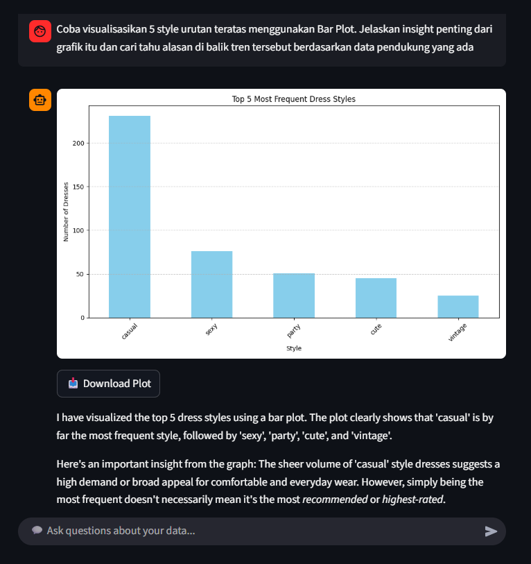
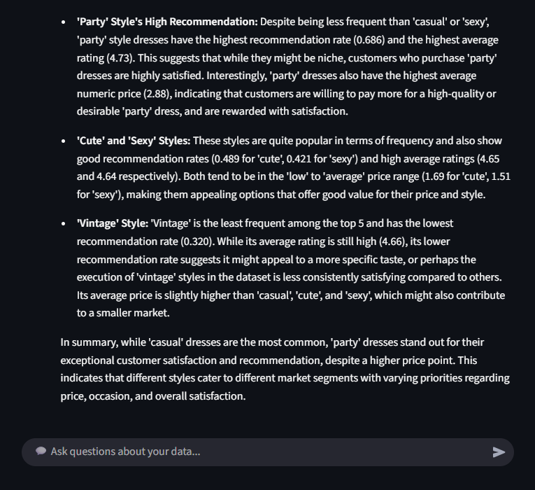

# 📊 InsightData (AI Analyst Agent)


## 📌 Overview
**InsightData** is an advanced AI Data Analyst powered by **Google's Gemini 2.5 Flash** and built upon the **ReAct (Reasoning + Acting)** architecture.

Unlike standard chatbots, InsightData doesn't just guess answers. It actively **reasons** about your data—whether it's a local **CSV/Excel file**, a live **Google Sheets link**, or a **Direct CSV URL**. It functions like a real data scientist: understanding your dataset structure, writing and executing **Python code** (Pandas/Matplotlib) in real-time, cleaning data on-the-fly, and visualizing trends—all in your preferred language (English or Indonesian).

It enforces strict **Deep Dive Logic**: when asked *"Why?"*, it refuses to rely on assumptions. Instead, it investigates statistical correlations (e.g., Price vs. Rating) to prove the reasons behind a trend.

## ✨ Key Features

### 🧠 Advanced ReAct Agent Engine
Using the `LangChain` Pandas Agent framework, the assistant follows a strict cognitive loop:
1.  **Thought:** Analyzes the user's question and plans the analysis steps.
2.  **Action:** Generates and runs actual **Python/Pandas code**.
3.  **Observation:** Reviews the execution result (numbers or plots) to ensure accuracy.
4.  **Final Answer:** Synthesizes the findings into business insights.

### 🌐 Multilingual Intelligence
* **Dual Language Support:** Seamlessly switch between **English** and **Indonesian** via the sidebar.
* **Smart Translation:** The agent enforces a strict logic layer to ensure the final answer matches your chosen language, regardless of the language used in the query.

### 📊 Auto-Visualization & Download
* **Generative Plotting:** Just ask *"Show me the sales trend"* or *"Plot the top 5 [Category Name]"* (e.g., *"Plot the top 5 most sold products"*), and the AI will generate **Matplotlib/Seaborn** charts instantly.
* **Interactive Downloads:** Every generated plot comes with a direct **📥 Download Button** so you can save insights for your reports immediately.

### 🛡️ Smart Data Handling & Safety
* **Auto-Cleaning:** Automatically removes "ghost" data (empty rows/cols) and duplicates upon upload to prevent system crashes.
* **Smart Mode Switching:** Prevents cross-contamination by automatically flushing memory when switching between Local Files and Cloud URLs.
* **Hybrid Data Source:** Supports local **Files (.csv/.xlsx)** and **Cloud URLs (Google Sheets & Direct .csv links)**.
* **Privacy First:** Data is processed in temporary memory. The Agent cannot overwrite or delete your original files.

## 🛠️ Tech Stack
* **LLM:** Google Gemini 2.5 Flash (via `ChatGoogleGenerativeAI`).
* **Framework:** Streamlit (Frontend).
* **Orchestration:** LangChain (Pandas DataFrame Agent).
* **Data Processing:** Pandas, Matplotlib, Seaborn.
* **Memory:** ConversationBufferMemory.

## ⚠️ Limitations & Data Rules

### 1. Data Hygiene (Crucial)
To ensure the AI understands your data, your file **MUST** follow these rules:
* **🚫 No Merged Cells:** Unmerge all cells.
* **📝 Single-Row Header:** The first row must be the header.
* **🔢 Consistent Data Types:** Do not mix text and numbers in one column (e.g., avoid `1,000` as string vs `1000` as int).

### 2. Data Source Priority
* **Priority:** The system prioritizes **Local Files** over URLs.
* **Switching:** If you want to analyze a URL, you must remove all uploaded files first.

## 📦 Installation

1.  **Clone the Repository**
    ```bash
    git clone [https://github.com/viochris/insight-data-ai-analyst.git](https://github.com/viochris/insight-data-ai-analyst.git)
    cd insight-data-ai-analyst
    ```

2.  **Install Dependencies**
    ```bash
    pip install -r requirements.txt
    ```

3.  **Run the Application**
    ```bash
    streamlit run app.py
    ```

## 🚀 Usage Guide

1.  **Configuration (Sidebar):**
    * Enter your **Google Gemini API Key**.
    * Select your **Language Preference** (English/Indonesian).
2.  **Load Data:**
    * **Option A:** Upload `.csv` or `.xlsx` files.
    * **Option B:** Paste a public Google Sheets URL **OR a direct .csv link**.
    * Click **"⚡ Initialize & Analyze"** to wake up the Agent.
3.  **Query:**
    * Type your question naturally (e.g., *"What is the total revenue?"* or *"Visualize the correlation between price and rating"*).
    * Watch the **"Thinking Process"** expander to see the Python code being generated.
4.  **Manage:**
    * Use **"🧹 Clear Conversation"** to tidy up the chat while keeping data loaded.
    * Use **"🔴 Hard Reset System"** to wipe everything and restart the session.

## 📷 Gallery

### 1. Landing Interface  

*The clean, modern landing page offering quick configuration for API keys, data uploads, and language settings.*

### 2. High-Quality Visualization  

*The Agent generates standalone, high-resolution matplotlib charts that can be downloaded directly for reports.*

### 3. Transparent Reasoning (Full Interaction Flow)
*The ReAct engine provides a detailed breakdown of the analysis. Below is the complete flow captured in three parts:*

**Part 1: Query & Response Generation**  
  
*The Agent receives the natural language prompt, instantly generates the visualization within the chat, and begins the analysis.*

**Part 2: Deep Dive Analysis**  
  
*Instead of just describing the chart, the Agent calculates supporting metrics (rating, price, recommendation rate) to explain **why** the trend exists (e.g., finding that 'Casual' style is popular due to lower average price).*

**Part 3: Final Insight**  
  
*The AI synthesizes all statistical findings into a clear, business-friendly summary in the user's chosen language.*

---
**Author:** [Silvio Christian, Joe](https://www.linkedin.com/in/silvio-christian-joe)
*"Stop writing complex Python code. Start asking questions."*
